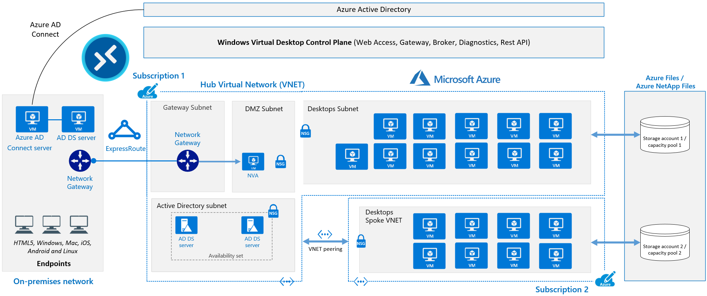
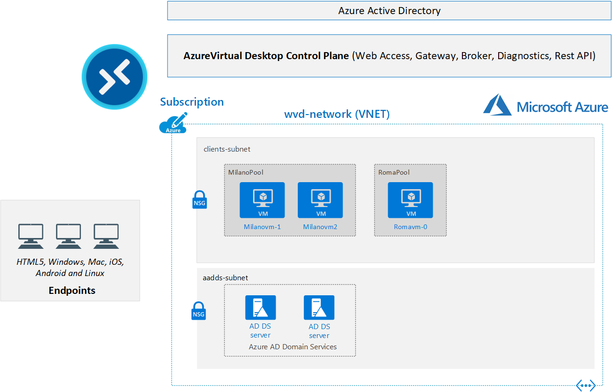
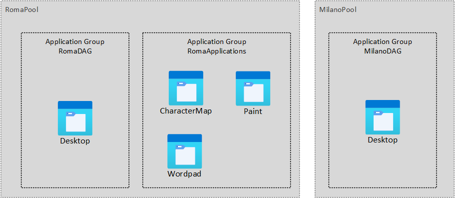

# Playground design

This diagram shows a typical <a href="https://docs.microsoft.com/en-us/azure/architecture/example-scenario/wvd/windows-virtual-desktop" target="_blank">architectural setup</a> for Azure Virtual Desktop

* The application endpoints are in the customer's on-premises network. 
* ExpressRoute extends the on-premises network into the Azure cloud, and Azure AD Connect integrates the customer's Active Directory Domain Services (AD DS) with Azure Active Directory (Azure AD).
* The Azure Virtual Desktop control plane handles Web Access, Gateway, Broker, Diagnostics, and extensibility components like REST APIs.
* The customer manages AD DS and Azure AD, Azure subscriptions, virtual networks, Azure Files or Azure NetApp Files, and the Windows Virtual Desktop host pools and workspaces.
* To increase capacity, in this schema, the customer uses two Azure subscriptions in a hub-spoke architecture, and connects them via virtual network peering.

The diagram below shows the AVD playground we will create:

* a V-Net with 2 subnets
    * subnetAD: in this subnet will be deployed an istance of Azure Active Directory Domain  Services. This full managed Active Domain will simplify the setup because  with few clicks you will have 2 Active Directory servers fully managed with an Azure AD Connect in place, an ideal configuration for WVD
    * subnetClients: in this subnet will be deployed all hosts (VM) used by WVD
* 2 Host pools (MilanoPool and RomaPool)
* MilanoPool has
    * 2 hosts (Milanovm-1 and Milanovm-2)
    * 1 Application group (MilanoDAG) with desktop access
* Romapool has
    * 1 host (romavm-1)
    * 1 Application group (RomaDAM) with desktop access
    * 1 Application group (RomaApplications) with 3 apps 

Users will have the following access:

| User   | Application Groups                   |
|--------|--------------------------------------|
| User01 | RomaPoolDAG, MilanoPoolDAG, RomaApplications |
| User02 | RomaApplications                     |
| User03 | RomaApplications                     |

# Prerequisites

in order to create this lab you need:

* an Azure subscription (also Visual Studio subscribers benefit is ok)
* an Azure Active Directory Tenant where you are able to create users, groups etc.

> from cloud shell execute [01-resource-group.sh](shell-script/01-resource-group.sh) using the command `source 01-resource-group.sh`

# Azure Active Directory preparation

If you plan to create and destroy the lab, using the same Azure Active Directory, **it is important to delete and re-create these account each time you rebuild the environemnt**.

| User UPN                                  | password       | role
|-------------------------------------------|----------------|-------------------------
| user01@\<yourtenantname\>.onmicrosoft.com | pa.123.assword |Active Directory administrator
| user02@\<yourtenantname\>.onmicrosoft.com | pa.123.assword |standard user
| user03@\<yourtenantname\>.onmicrosoft.com | pa.123.assword |standard user

# Azure AD Domain Services

From Azure portal, create an Azure AD Domain Services with the following parameters:

Basic
* DNS domain name: `demo.nicold`
* Region: `any`
* SKU: `standard`
* Forest type: `user`

Network
* Virtual Network: `aadds-vnet`
* Subnet: `aadds-subnet`

Administration
* Notifications
    * All Global Administrators of the Azure AD directory.
    * Members of the AAD DC Administrators group.
      * Add `User01` as administrator

| Groups                                    | members 
|-------------------------------------------|-----------------------------------
| AAD DC Administrators                     | user01@<yourtenantname\>.onmicrosoft.com

Synchronicazion
* Synchronization type: All

Security Settings
* keep all default settings

when the deploy finish:
* the activity coud require more than 1 hour for the first sync
* Fix the DNS following the recomendation shown on overview page
* access with user01 and user02 on portal.azure.com and change the password so that the password is replicated also back in AD

# Virtual Network
The previous step creates also the following virtual network:
* Name: `aadds-vnet`
* Address space: `10.0.0.0/24`
* Subnets (name - range)
    * `aadds-subnet` - `10.0.0.0/24`

On this virtual network you need to add another subnet for your host pools, as following:

* Add the Address space: `10.0.1.0/24`
* Subnets (name - range)
    * `subnetClients` - `10.0.1.0/24`

# Finalize AD Domain Services setup
* Wait a least `2 hours` to allow AADDS service creation and first accounts sync from AAD to AADDS.
* From Azure Portal, go to AADDS and fix the `DNS issue`
* For each account (`User01`, `User02`, `User03`)
  * Open an in private browser window, navigate to <https://account.activedirectory.windowsazure.com/ChangePassword.aspx> and change his password. This forces a user password sync AAD->AD and it is required to allows users to logon on virtual machines

# Create Host Pool 1 (Roma)

use the following parameter to create the RomaPool

Basic

* Host pool name: `RomaPool`
* Validating environment: `No`
* Preferred app group type: `Desktop`
* Host pool type: `Pooled`
* Load Balancing algorithm: `Bread-first`
* Max Session limit: `2`

Virtual Machines

* Add Virtual Machines: `Yes`
* Resource Group: defaulted as host pool
* Name Prefixç `RomeVm`
* Availability options: `No infrastructure redundancy required`
* Image Type: `Gallery`
* Image: `Windows 11 Ent Multisession`
* VM Size: `D2s v3`
* Number of VM: `1`
* OS disk type: `Standard HDD`
* Boot Diagnostic: `disabled`
* Virtual Network: `avd-network`
* subnet: `subnetClients`
* Network Security Group: `none`
* directory join type: `Active Directory`
* AD domain join UPN: `user01@demo.nicold`
* password: \*********
* Specify domain or unit: `no`
* Virtual Machine Admin account: `myAdminAccount`
* password: \*********

WorkSpace

* Register desktop app group: `Yes`
* Workspace Name: `RomaWorkspace`

when the host pool is ready, add user1 to RomaPoolDAG Application group

# Create Host Pool 2 (Milano)

use the following parameter to create the RomaPool

Basic

* Host pool name: `MilanoPool`
* Validating environment: `No`
* Host pool type: `Pooled`
* Load Balancing algorithm: `Bread-first`
* Max Session limit: `2`

Virtual Machines

* Add Virtual Machines: `Yes`
* Resource Group: `defaulted as host pool`
* Name Prefix: `MilanVm`
* Availability options: `No infrastructure redundancy required`
* Image Type: `Gallery`
* Image: `Windows 11 Ent Multisession`
* VM Size: `D2s v3`
* Number of VM: `2`
* OS disk type: `Standard HDD`
* Boot Diagnostic: `disabled`
* Specify domain or unit: `Yes`
 directory join type: `Active Directory`
* AD domain join UPN: `user01@demo.nicold`
* password: \*********
* Specify domain or unit: `no`
* Virtual Network: `avd-network`
* subnet: `subnetClients`
* Network Security Group: `none`
* AD domain join UPN: `user01@demo.nicold`
* password: \*********
* Virtual Machine Admin account: `myAdminAccount`
* password: \*********

WorkSpace

* Register desktop app group: `Yes`
* Workspace Name: `MilanoWorkspace`

when the host pool is ready, add user1 to MilanoPoolDAG Application group

# Create an Additional Application group
From Windows Virtual Desktop -> Application groups -> Create

Basics

* HostPool: `RomaPool`
* Application Group Type: `Remote App`
* Application Group Name: `RomaApplications`

Applications
* Start menu -> Character Map
* Start menu -> Microsoft Edge
* Start menu -> Wordpad

Assignments
* User01
* User02
* User03

Workspace
* Register application group: YES
* Register application group: RomaWorkspace

# Associate User01 to Desktop Rome and Milan
From Windows Virtual Desktop -> Application groups 

* Application Group: `MilanoPool-DAG` > Assignments: `user01`
* Application Group: `RomaPool-DAG` > Assignments: `user01`

# Auto poweroff virtual machines
For each machine, go to settings> auto-shutdown and enable an autoshutdown routine

# Additional settings for `RomaPool` Hosts 
go to `Settings`>`RDP Settings`
  * Display Settings
    * Multi Display Support: `No`
    * Screen mode: `window`
    * Dynamic resolution: `Session resolution updates as the local windows resizes`
    * Desktop size: `1024x768`

